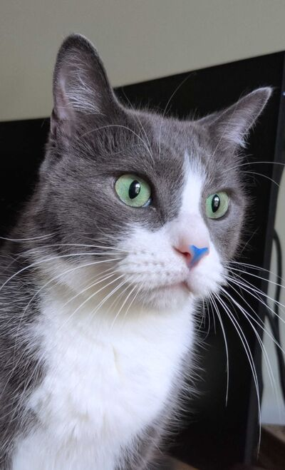

### Digital Craftsman

Fullstack Developer focused on user interfaces and developer tooling

Building my [PKM](https://en.wikipedia.org/wiki/Personal_knowledge_management) system with [Neorg](https://github.com/nvim-neorg/neorg), I created and maintain:

- [vite-plugin-norg](https://github.com/bottd/vite-plugin-norg) - Transform `.norg` files into HTML, React, or Svelte components
- [neorg-worklog](https://github.com/bottd/neorg-worklog) - Automatically log files you've worked on to your daily journal
- [neorg-archive](https://github.com/bottd/neorg-archive) - Create and manage an archival workspace for your Neorg notes

I write about my work at [drake.dev](https://drake.dev)

